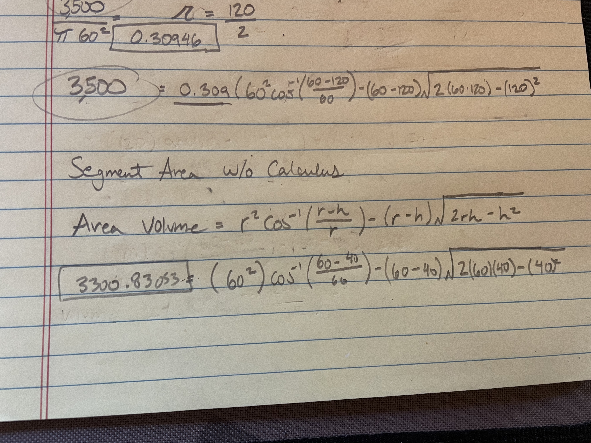

[Math Exchange Query](https://math.stackexchange.com/)

[Dipstick Logic](https://math.stackexchange.com/questions/972129/volume-of-a-horizontal-cylinder-using-height-of-liquid)

[Calculating Volume based on Circle Segment Method Wiki](https://en.wikipedia.org/wiki/Circular_segment)

[Volume of a Segment Area](https://www.mathopenref.com/cylindervolpartial.html)

[Equation for a Segment Area](https://www.mathopenref.com/segmentareaht.html)

## Correct Formulas:

**Segement Area**



**Sement Area Deduction Process**

```
 Volume = pi*r^2*height
 height = Volume/(pi*r^2)
```
**Volume of a Cylinder**

use the volume of the cylinder equation to deduct the height of the cylinder